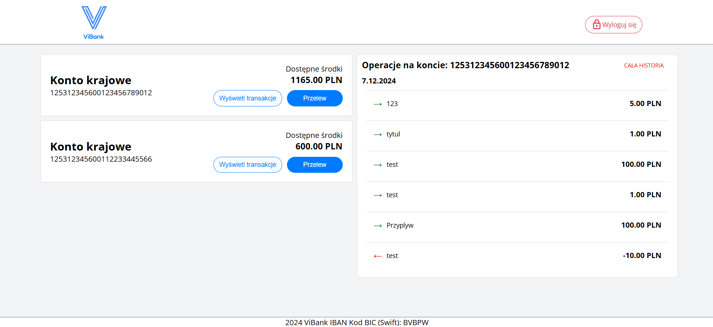
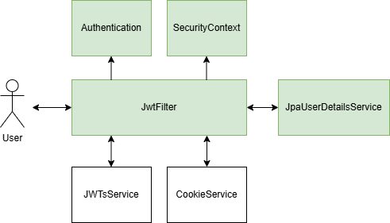

# ViBank
This application is a secure online banking platform that allows users to manage their accounts and perform transactions. It provides a well-structured interface for viewing account balances, reviewing transaction histories, and processing fund transfers. Additionally, the system integrates two-factor authentication and multiple security mechanisms—such as Content Security Policies, CSRF tokens, HttpOnly cookies with the SameSite=Strict attribute, password brute-force prevention, and input sanitization—to protect user data from unauthorized access.

## Table of Contents
- [Technologies](#Technologies)
- [Setup](#Setup)
- [Global Architecture](#Global-Architecture)
- [List of Security Features](#List-of-Security-Features)
- [Design](#Design)
- [Spring Security](#Spring-Security)
- [API](#API)

# Technologies
- **Spring Boot**: 3.3.2 version
- **Spring Security**: 6.1.2 version
- **React**: 18.3.1 version
- **Java**: 17 version
- **MySQL**: 8.0.39 version

# Setup

# Global Architecture
<div align="center">
  
</div>

# List of Security Features

- Two Factory Authentication
- Hashing Passwords
- CSRF:
    - Token CSRF
    - CSRF Token generated using Secure Random
    - SameSite Strict cookie attribute
- Bruteforce Password Protection
- XSS
    - Content Security Policy (CSP)
    - HttpOnly cookies
    - Input and Output Sanitization (Additional, React provides its own mechanisms)
    
# Design
<div align="center">
  
</div>
<div style="height: 20px;"></div> 
<div align="center">
  
</div>

# Spring Security
## First-level authentication scheme
<div align="center">
  
</div>

## Second-level authentication scheme
<div align="center">
  
</div>

## Authorization scheme for users with a valid JWT token
<div align="center">
  
</div>

## CSRF token validation process
<div align="center">
  
</div>

# API
- **/auth** Handles user authentication processes, including login, two-factor authentication (2FA), logout, user creation, and resetting failed login attempts

- **/accounts** Manages user bank accounts by allowing authenticated users to retrieve their existing accounts and administrators to create new ones

- **/transactions** Enables users to perform and view financial transactions.

- **/photos** Provides photos to the frontend application


## /auth
1. `/auth/login`
    - **Method:** `POST`
    - **Description:** Authenticates a user with their PID and password. Initiates the first phase of authentication by issuing a JWT token and sending a 2FA code to the user's email.
    - **JWT Token:** Not Required
    - **CSRF Token in "X-CSRF-Token" header:** Not Required
    - **Admin Privileges Required:** False 
    
    ```json
    {
      "pid": "12345678",
      "password": "SecureP@ssw0rd!"
    }
    ```
    
    **Successful Response (200 OK):**
    
    ```json
    "Wysłano kod na adres email"
    ```
    
    **Error Response (403 Forbidden):**
    
    ```json
    "Błędny identyfikator lub hasło"
    ```

2. `/auth/2fa`
    - **Method:** `POST`
    - **Description:** Completes the authentication process by verifying the 2FA code sent to the user's email.
    - **JWT Token:** "temporary" JWT token Required
    - **CSRF Token in X-CSRF-Token header:** Not Required
    - **Admin Privileges Required:** False 
    
    ```json
    {
      "codeValue": "654321"
    }
    ```
    
    **Successful Response (200 OK):**
    
    ```json
    "Witaj w ViBank"
    ```
    
    **Error Response (403 Forbidden):**
    
    ```json
    "Podany kod jest nieprawidłowy lub wygasł. Proszę ponownie się zalogować"
    ```

3. `/auth/logout`
    - **Method:** `POST`
    - **Description:** Logs out the authenticated user by invalidating their JWT token.
    - **JWT Token:** Required
    - **CSRF Token in "X-CSRF-Token" header:** Required    
    - **Admin Privileges Required:** False 
    
    _No request body._
    
    **Successful Response (200 OK):**
    
    ```json
    "Wylogowano"
    ```
    
    **Error Response (403 Forbidden):**
    
    ```json
    "Proces wylogowania nie powiódł się"
    ```

4. `/auth/create-user`
    - **Method:** `POST`
    - **Description:** Creates a new user account.
    - **JWT Token:** Required
    - **CSRF Token in "X-CSRF-Token" header:** Required      
    - **Admin Privileges Required:** True 
    
    ```json
    {
      "password": "UserP@ssw0rd!",
      "firstName": "John",
      "lastName": "Doe",
      "email": "john.doe@example.com",
      "phone": "+48123456789",
      "role": "USER" // Possible values: "ADMIN", "USER"
    }
    ```
    
    **Successful Response (201 Created):**
    
    ```json
    "Stworzono użytkownika o numerze pid:87654321"
    ```
    
    **Error Response (400 Bad Request):**
    
    ```json
    "Wprowadzono niepoprawne dane użytkownika: Email już istnieje"
    ```

5. `/auth/restart-tries`
    - **Method:** `POST`
    - **Description:** Resets the failed login attempts counter for a user.
    - **JWT Token:** Required
    - **CSRF Token in "X-CSRF-Token" header:** Required   
    - **Admin Privileges Required:** True 
     
    ```json
    {
      "pid": "12345678"
    }
    ```
    
    **Successful Response (200 OK):**
    
    ```json
    "Licznik został zresetowany"
    ```
    
    **Error Response (403 Forbidden):**
    
    ```json
    "Nie masz uprawnień do zresetowania liczników prób logowania."
    ```

## /accounts

1. `/accounts/`
    - **Method:** `GET`
    - **Description:** Retrieves all accounts associated with the authenticated user.
    - **JWT Token:** Required
    - **CSRF Token in "X-CSRF-Token" header:** Required   
    - **Admin Privileges Required:** False 
      
    **Successful Response (200 OK):**
    
    ```json
    [
      {
        "accountNumber": "125312345612345678",
        "balance": "1500.00"
      },
      {
        "accountNumber": "125312345612345679",
        "balance": "2500.50"
      }
    ]
    ```
    
    **Error Response (403 Forbidden):**
    
    ```json
    "Nie jesteś właścicielem tego rachunku"
    ```

2. `/accounts/`
    - **Method:** `POST`
    - **Description:** Creates a new bank account for the authenticated user.
    - **JWT Token:** Required
    - **CSRF Token in "X-CSRF-Token" header:** Required
    - **Admin Privileges Required:** True 
    
    **Request Body:**
    
    ```json
    {
      "pid": "12345678"
    }
    ```
    
    **Successful Response (201 Created):**
    
    ```json
    "Stworzono nowy rachunek o numerze: 125312345612345680"
    ```
    
    **Error Response (400 Bad Request):**
    
    ```json
    "Wprowadzono niepoprawne dane rachunku"
    ```
## /transactions

1. `/transactions`
    - **Method:** `GET`
    - **Description:** Retrieves a paginated list of transactions for a specific account belonging to the authenticated user.
    - **JWT Token:** Required
    - **CSRF Token in "X-CSRF-Token" header:** Required   
    - **Admin Privileges Required:** False 
     
    **Query Parameters:**
    
    - `accountNumber` (required): `string` — The account number to fetch transactions for.
    - `page` (optional): `integer` — The page number (default: `0`).
    - `size` (optional): `integer` — The number of transactions per page (default: `6`, max: `20`).
    
    **Example Request URL:**
    
    ```
    /transactions?accountNumber=125312345612345678&page=0&size=10
    ```
    
    **Successful Response (200 OK):**
    
    ```json
    {
      "2024-01-15": [
        {
          "transactionRecipientName": "Alice Smith",
          "title": "Payment for Invoice #123",
          "recipientsAccountNumber": "125312345612345679",
          "amount": "500.00",
          "senderAccountNumber": "125312345612345678",
          "isProfit": false,
          "date": "2024-01-15"
        },
        {
          "transactionRecipientName": "Bob Johnson",
          "title": "Refund",
          "recipientsAccountNumber": "125312345612345678",
          "amount": "200.00",
          "senderAccountNumber": "125312345612345680",
          "isProfit": true,
          "date": "2024-01-15"
        }
      ],
      "2024-01-14": [
        {
          "transactionRecipientName": "Charlie Brown",
          "title": "Salary",
          "recipientsAccountNumber": "125312345612345678",
          "amount": "1500.00",
          "senderAccountNumber": "125312345612345681",
          "isProfit": true,
          "date": "2024-01-14"
        }
      ]
    }
    ```
    
    **Error Responses:**
    
     **403 Forbidden:**
    

        "Nie jesteś właścicielem tego rachunku"

    
     **400 Bad Request:**
    

        "Numer strony oraz jej rozmiar musi być liczbą całkowitą"


2. `/transactions/`
    - **Method:** `POST`
    - **Description:** Initiates a new transaction from the authenticated user's account to another account.
    - **JWT Token:** Required
    - **CSRF Token in "X-CSRF-Token" header:** Required
    - **Admin Privileges Required:** False 
     
    **Request Body:**
    
    ```json
    {
      "transactionRecipientName": "Alice Smith",
      "title": "Payment for Invoice #123",
      "recipientsAccountNumber": "125312345612345679",
      "amount": "500.00",
      "senderAccountNumber": "125312345612345678"
    }
    ```
    
    **Successful Response (200 OK):**
    
    ```json
    "Transakcje przeprowadzono pomyślnie"
    ```
    
    **Error Responses:**
    
     **403 Forbidden:**
    
        
        "Nie jesteś właścicielem tego rachunku"

    
     **400 Bad Request:**
    

        "Niewystarczająco środków na koncie"

    
     **404 Not Found:**
    
        "Nieznaleziono podanego numeru rachunku"

## /photos

1. `/photos/{name}`
    - **Method:** `GET`
    - **Description:** Retrieves an image file by its name.
    - **JWT Token:** Not Required
    - **CSRF Token in "X-CSRF-Token" header:** Not Required
    - **Admin Privileges Required:** False 
     
    **Example Request URL:**
    
    ```
    /photos/profile-picture.png
    ```
    
    **Successful Response (200 OK):**
    
    - **Headers:**
        - `Content-Type: image/png`
    - **Body:**
        - Binary image data.
    
    **Error Response (404 Not Found):**
    
    ```json
    "Plik nie został odnaleziony"
    ```

---


